# Lab Guide: Installing Raspberry Pi OS Lite on a Raspberry Pi Zero

## Objective

To flash **Raspberry Pi OS Lite** onto a microSD card for a **Raspberry Pi Zero / Zero W / Zero 2 W**, using the **Raspberry Pi Imager** tool, then complete Wi-Fi and SSH setup manually with `raspi-config` so the Pi can be used headlessly from then on.

---

## Phase 1: What You Need

- A **Raspberry Pi Zero**, **Zero W**, or **Zero 2 W**
- A **microSD card** (8 GB minimum, 16 GB+ recommended)
- A computer with an **SD card reader** (built-in or USB adapter)
- A **USB cable/adapter** to power the Pi
- A **mini HDMI to HDMI adapter/cable** and a monitor, plus a **micro-USB OTG adapter** and USB keyboard — needed once, for the initial `raspi-config` setup (see Phase 6)
- Wi-Fi network details (SSID and password), if using a wireless model
- Internet access on your computer to download the imaging tool

> **Why "Lite"?** Raspberry Pi OS Lite has no desktop environment. It is ideal for the Pi Zero because of its limited RAM and CPU, and it is well suited to headless projects (servers, IoT devices, sensors).

---

## Phase 2: Install Raspberry Pi Imager

1. Go to the official Raspberry Pi software page and download **Raspberry Pi Imager** for your operating system (Windows, macOS, or Linux).
2. Install and open the application.

> Raspberry Pi Imager walks you through the whole process as a step-by-step wizard, shown as a list on the left (**Device → OS → Storage → Customisation → Writing → Done**). The current step is always highlighted in red.

---

## Phase 3: Flashing the OS

### Step 1: Choose the Device

1. Open **Raspberry Pi Imager**.
2. Click **Choose Device**.
3. Select your exact model from the list:

   - **Raspberry Pi Zero** (also covers Zero W and Zero WH)
   - **Raspberry Pi Zero 2 W**

4. Click **Next**.

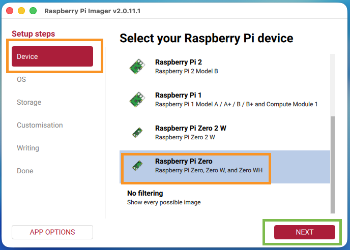

*The **Device** step is selected in the sidebar. Here, "Raspberry Pi Zero" is chosen, which also covers the Zero W and Zero WH boards. Selecting the exact model matters because it tells the Imager which images and settings are compatible with your hardware, and it will filter the OS list on the next screen accordingly. Click the red **Next** button (bottom right) once your model is highlighted.*

### Step 2: Choose the OS

1. Click **Choose OS**.
2. Select **Raspberry Pi OS (other)** — this reveals additional, more specific OS builds.

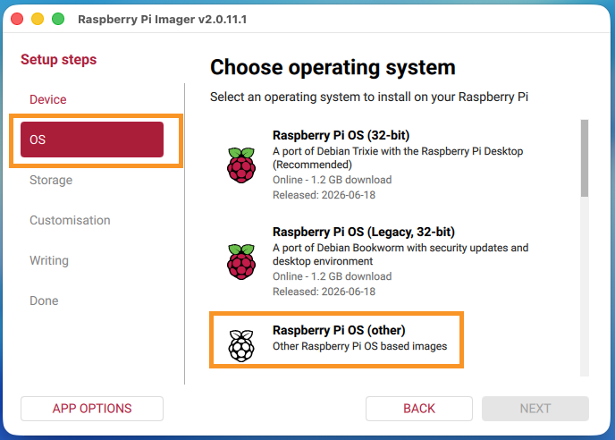
*The default entries at the top ("Raspberry Pi OS (32-bit)" and "Legacy") include the full desktop environment, which is too heavy for a Pi Zero. Choosing **Raspberry Pi OS (other)** opens a submenu with lighter, more specific builds — including the Lite edition we need.*

3. From the submenu, select **Raspberry Pi OS Lite (32-bit)**, then click **Next**.

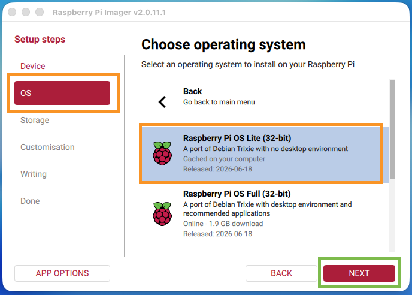

*"Raspberry Pi OS Lite (32-bit)" is a port of Debian with **no desktop environment** — just a command-line system. This keeps RAM and CPU usage low, which suits the Pi Zero's limited hardware.*

   > The Pi Zero's ARM11/ARM Cortex-A53 processor is 32-bit friendly, so the **32-bit** build is the standard recommended choice, even on the Zero 2 W.

### Step 3: Choose the Storage

1. Insert the microSD card into your computer.
2. Click **Choose Storage**.
3. Select the correct microSD card, then click **Next**.

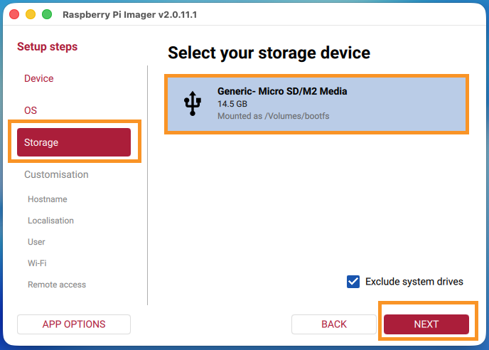

*The Imager lists the removable/SD storage devices it can see (system drives are excluded by default via the **Exclude system drives** checkbox, bottom right, which prevents you from accidentally targeting your computer's own hard drive). Confirm the size shown (here, 14.5 GB) matches your microSD card.*

   > **Warning:** Double-check you have selected the correct drive. A later step will **erase all data** on the selected storage device.

---

## Phase 4: Customisation — Hostname, Localisation & User Account

After Storage, the wizard moves into the **Customisation** section. Here you set the Pi's hostname, locale, and login so it's ready to log into from the very first boot. Each item below is its own page in the sidebar, but they're all part of the same **Customisation** step.

> **Note:** Wi-Fi and SSH are deliberately left disabled in this step — you'll enable them yourself afterwards using `raspi-config` (Phase 6), as practice with headless administration from the command line. Until then, the Pi needs a monitor and keyboard connected directly (see Phase 6).

### Hostname

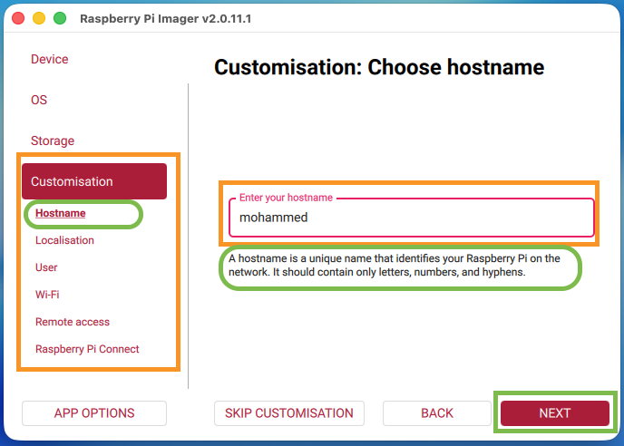

*Enter a unique **hostname** for the Pi on your network (e.g. `pizero`). As the on-screen tip explains, it should contain only letters, numbers, and hyphens. You'll use this name later to connect over SSH (`ssh user@<hostname>.local`), so it's worth choosing something memorable.*

> **What is a hostname?** A hostname is the human-readable name a device identifies itself by on a network — an alternative to remembering its numeric IP address (e.g. `192.168.1.42`), which can change each time the device reconnects. On most home/school networks, devices are also reachable via `<hostname>.local` (using mDNS/Bonjour) instead of typing the IP each time.
>
> **Where you'll use it:**
> - **Connecting over SSH** from your computer: `ssh <username>@<hostname>.local` (see Phase 7).
> - **Identifying the Pi** on your router's device list or network scanner, especially useful when you have several Pis on the same network — each should get its own unique hostname.
> - **The terminal prompt** on the Pi itself shows the hostname (e.g. `pi@pizero:~$`), which is handy for confirming which device you're logged into when working with multiple Pis at once.
>
> Choose something distinct from the defaults other students in the room might use (e.g. include your name or student ID) to avoid two Pis claiming the same hostname on the shared network, which can cause `<hostname>.local` to resolve to the wrong device.

### Localisation

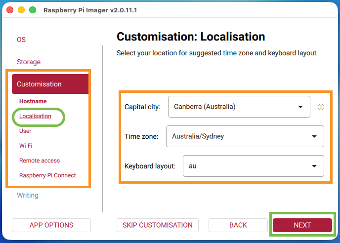

*Choose your **capital city**, which auto-fills a sensible **time zone** and **keyboard layout** (here, Canberra/Australia sets `Australia/Sydney` and the `au` keyboard layout). Getting the time zone right matters for anything time-sensitive (logs, scheduled tasks); getting the keyboard layout right matters if you ever type on the Pi directly, since it affects which characters symbols like `@` and `"` produce.*

### User

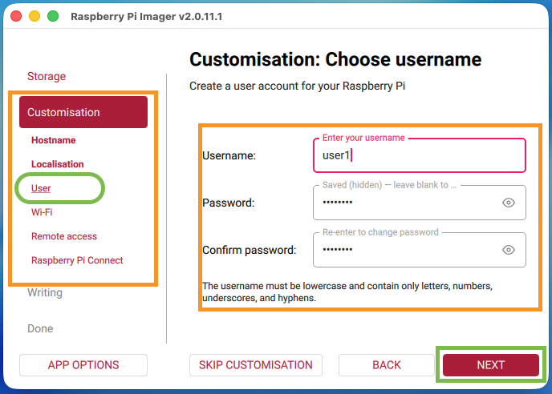

*Create a login **username** and **password** for the Pi. Do not leave this on the old default (`pi`/`raspberry`) — recent Raspberry Pi OS versions no longer ship a default account at all, so you must set one here or you won't be able to log in. The username must be lowercase and contain only letters, numbers, underscores, and hyphens.*

### Wi-Fi

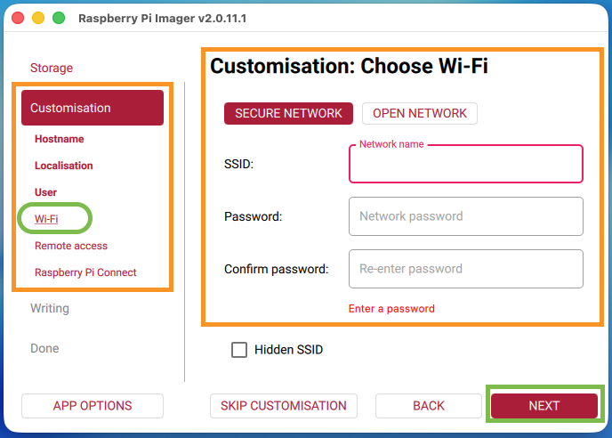

> **Leave this page blank** — do **not** enter your SSID/password here. You'll configure Wi-Fi in Phase 6 via `raspi-config`.

### Remote Access (SSH)

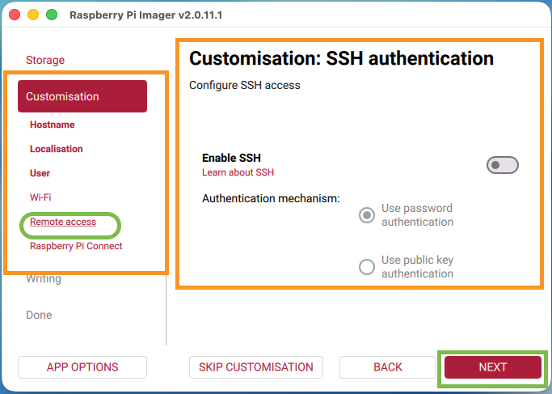

> **Leave Enable SSH off here too** — you'll enable it in Phase 6 via `raspi-config`.

### Raspberry Pi Connect

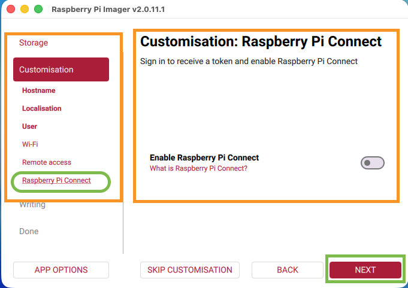

*A newer option in Raspberry Pi Imager: **Raspberry Pi Connect** is Raspberry Pi's own cloud-based remote access service (screen sharing and shell access via a browser, even behind NAT/firewalls). It's optional and requires signing in with a Raspberry Pi account. For this lab, leave it **disabled** — standard SSH (configured above) is sufficient and doesn't depend on an external account.*

---

## Phase 5: Write the Image

Once all Customisation pages are filled in, move to the **Writing** step.

1. Review the **Write image** summary screen, which lists your chosen device, OS, storage, and the customisations that will be applied. Click **Write**.

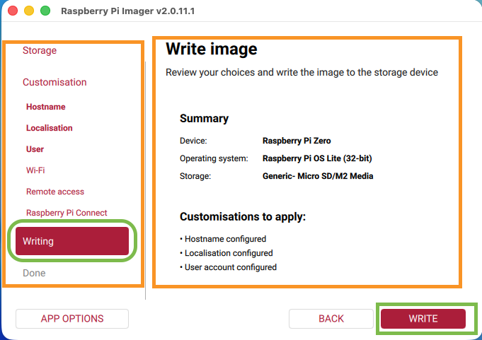

*This confirmation screen recaps every choice you made: Device (Raspberry Pi Zero), Operating system (Raspberry Pi OS Lite 32-bit), Storage (the microSD card), and which customisations will be applied. Check it carefully before proceeding, since the next step is destructive.*

2. Confirm you want to erase the storage device by clicking **I understand, erase and write**.

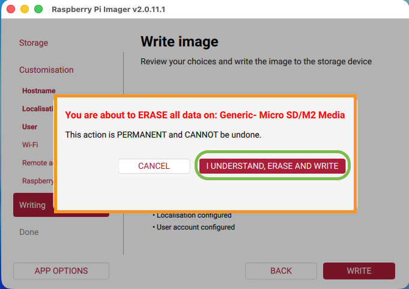

*A safety prompt warns that all data on the selected card will be **permanently erased** and this **cannot be undone**. This is your last chance to cancel if you selected the wrong drive back in Step 3.*

3. Wait while the Imager **writes** the image to the card.

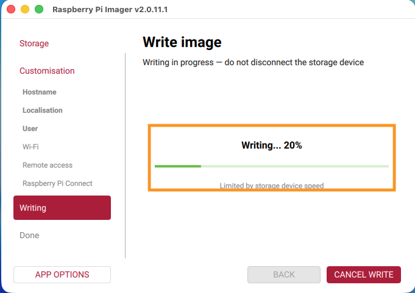

*A progress bar tracks the write (here, 20%). The message "do not disconnect the storage device" is important — pulling the card out mid-write will corrupt the image and you'll need to start over.*

4. The Imager then automatically **verifies** the written data.

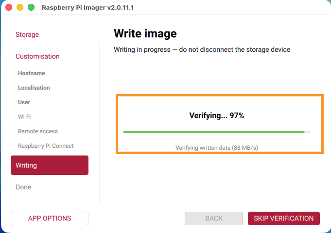

*After writing, the Imager re-reads the card and checks it against the source image (here, 97% at 88 MB/s) to make sure no bytes were corrupted in transit. You can click **Skip verification** to save time, but it's recommended to let it finish, especially on a card you haven't used before.*

5. When both steps complete, Raspberry Pi Imager confirms it is safe to remove the SD card.

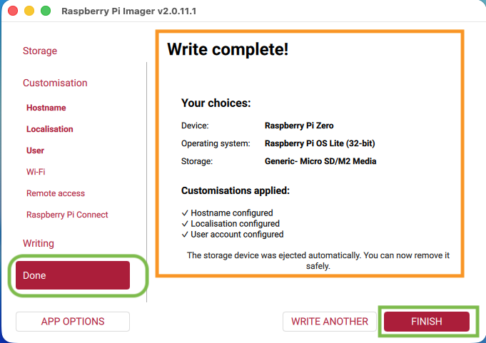

*The **Write complete!** screen recaps the device, OS, and storage used, and confirms which customisations were applied (Hostname, Localisation, User account — all ticked). It also notes the storage device was **already ejected automatically**, so it's safe to physically remove the card now. Click **Finish** to close the wizard.*

---

## Phase 6: First Boot & Initial Configuration (raspi-config)

Because Wi-Fi and SSH were left disabled in Phase 4, the Pi needs a **monitor and keyboard connected directly** for this one-time setup. Once Wi-Fi and SSH are enabled below, you won't need them again.

### Step 1: Connect and Boot

1. Remove the microSD card from your computer and insert it into the **microSD slot** on the Raspberry Pi Zero.
2. Connect the monitor to the Pi Zero's **mini HDMI port** (via your adapter/cable).
3. Connect the USB keyboard to the Pi Zero's **USB port** (labelled `USB`, not `PWR`) via your micro-USB OTG adapter.
4. Connect a **USB power cable** to the Pi Zero's **USB power port** (usually labelled `PWR`, not `USB`, on the earlier Zero models).
5. Wait 1–2 minutes for the first boot to complete (it will resize the filesystem in the background — you may see some log messages scroll past).
6. At the `login:` prompt, log in with the **username** and **password** you set in Phase 4.

### Step 2: Launch raspi-config

1. At the command prompt, run:

   ```
   sudo raspi-config
   ```

   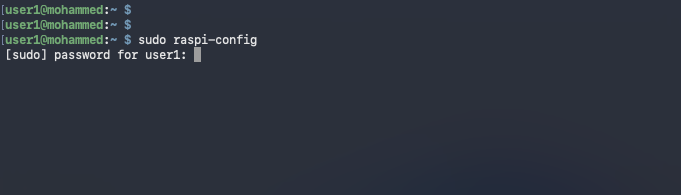
   
   *Run `sudo raspi-config` and enter your password when prompted for `sudo`.*

3. This opens a blue-and-white text menu — navigate with the **arrow keys**, select with **Enter**, and go back with **Tab**/**Esc**.

### Step 3: Set the Wireless LAN Country

Set this **before** connecting to Wi-Fi — an incorrect or unset country code can prevent the Wi-Fi radio from connecting at all, so doing this first avoids a confusing failure in the next step.

1. From the main menu, select **5 Localisation Options**.
2. Select **L4 WLAN Country**.
3. Choose your country from the list (e.g. **AU Australia**) and select **Ok**.

### Step 4: Connect to Wi-Fi

1. Back at the main menu, select **1 System Options**.

   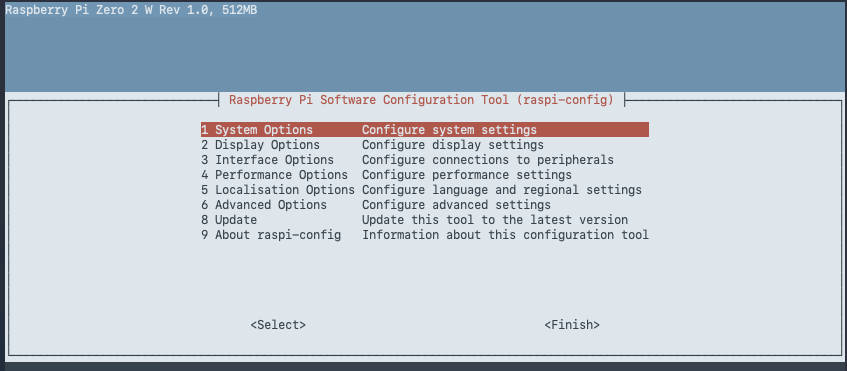

2. Select **S1 Wireless LAN**.

   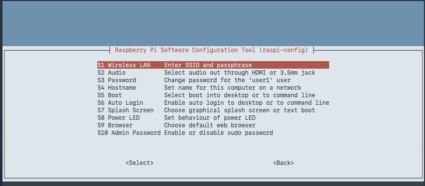

3. Enter your network's **SSID** and select **<Ok>**.

   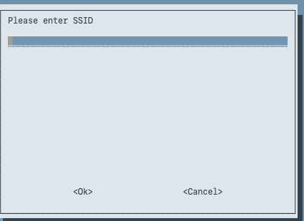

4. Enter your Wi-Fi **passphrase** and select **<Ok>**.

   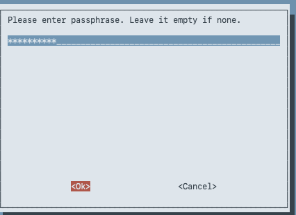

   > This step applies to the **Zero W** and **Zero 2 W** only — the original Pi Zero has no wireless radio and must stay on this monitor/keyboard connection or use a USB Ethernet/OTG network adapter instead.

   > **If you get the error "There was an error running option S1 Wireless LAN":** Exit out of `raspi-config`, then use `nmtui` instead:
   >
   > ```
   > sudo nmtui
   > ```
   >
   > 1. Select **Radio** and make sure **Wi-Fi** is enabled.
   > 2. Back at the main menu, select **Activate a connection**.
   > 3. Choose your Wi-Fi network (SSID) from the list and select **Activate**.
   > 4. Enter your Wi-Fi password when prompted, then select **OK**.
   > 5. Select **Back**, then **Quit** to exit `nmtui`.

### Step 5: Enable SSH

1. Back at the main menu, select **3 Interface Options**.

   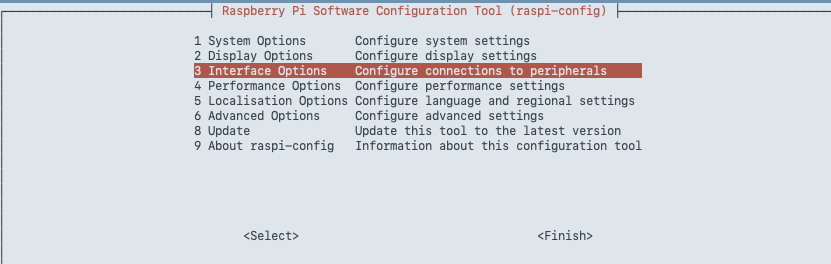

2. Select **I1 SSH**.

   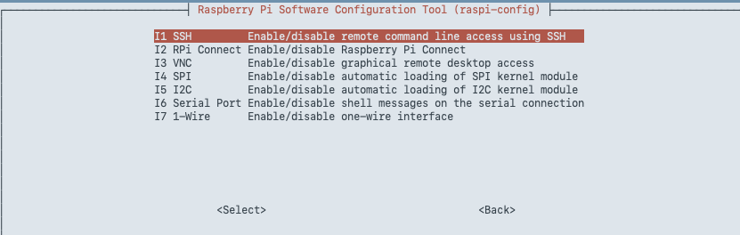

3. Choose **<Yes>** to enable the SSH server.

   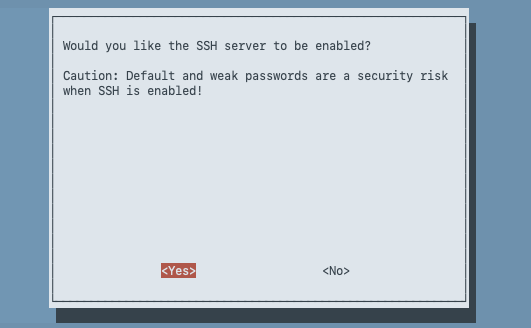

4. You'll see a confirmation that SSH is enabled — select **<Ok>**.

   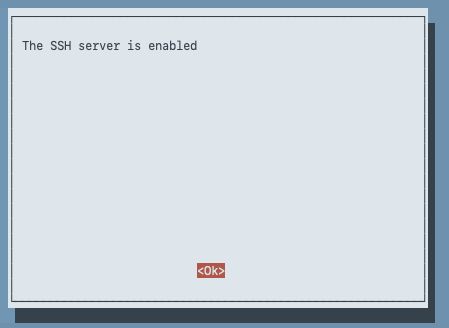

### Step 6: Finish

1. Use **Tab**/arrow keys to highlight **<Finish>** and press **Enter** to exit `raspi-config`.

   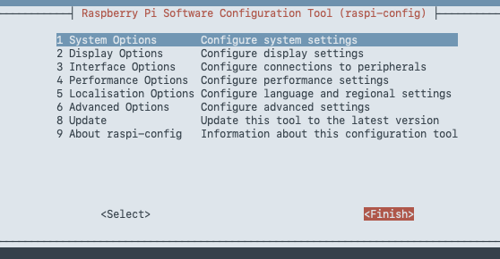

---

## Phase 7: Connecting Remotely

1. Before disconnecting the monitor and keyboard, find the Pi's **IP address** — back at the command prompt, run:

   ```
   ip a
   ```

   Look for the `inet` address under the `wlan0` section (e.g. `192.168.20.34`) and note it down. Keep this handy as a fallback in case `<hostname>.local` doesn't resolve on your network.

   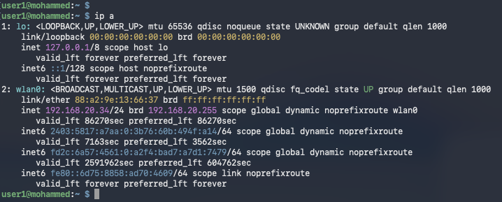

2. Reboot the Pi to make sure the new Wi-Fi and SSH settings take effect cleanly:

   ```
   sudo reboot
   ```

   

   Once it reboots, you can disconnect the monitor and keyboard — the Pi is ready for headless use.

3. From your computer, connect via SSH using either the hostname or the IP address you noted in Step 1:

   ```
   ssh <username>@<hostname>.local
   ```

   or

   ```
   ssh <username>@<ip-address>
   ```

   For example, connecting by hostname:

   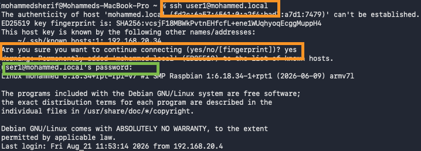
   
   *`ssh user1@mohammed.local` from the computer's terminal.*

   > **The first time** you connect to a given Pi, SSH will warn that "the authenticity of host ... can't be established" and show a key fingerprint. This is normal — it's SSH's way of asking you to trust this device since it's never seen it before. Type **yes** to continue, then enter the password when prompted. SSH remembers this device afterwards and won't ask again unless the Pi's identity changes (e.g. after re-flashing the SD card).

   Or connecting by IP address:

   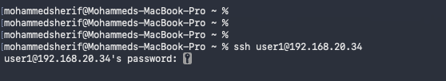
   
   *`ssh user1@192.168.20.34` from the computer's terminal, then enter the password when prompted.*

   > If `<hostname>.local` does not resolve, use the IP address instead. If that address has since changed (e.g. the Pi got a new DHCP lease after rebooting), run `ip a` again on the Pi (via monitor/keyboard) or check your router's device list for the current one.

---

## Troubleshooting

- **Pi does not boot / no LED activity:** Re-check the image was written successfully; try re-flashing.
- **No display on monitor:** Confirm you're using the **mini HDMI** port (not the power port) and that the adapter/cable is fully seated; try reconnecting power after the monitor is attached.
- **Keyboard not responding:** Confirm it's connected via the OTG adapter to the **USB** data port (not the `PWR` port), and try a powered USB hub if the keyboard draws too much current for the Pi to supply.
- **Can't connect over Wi-Fi:** Confirm the SSID/password and **Wireless LAN country** were set correctly in Phase 6, and that you're using the correct 2.4 GHz network (the Pi Zero W/Zero 2 W do not support 5 GHz).
- **"There was an error running option S1 Wireless LAN" in raspi-config:** Exit `raspi-config` and use `sudo nmtui` instead — select **Radio** and enable Wi-Fi, then select **Activate a connection** and choose your network (see Phase 6, Step 4).
- **SSH connection refused:** Confirm SSH was enabled in Phase 6 (**raspi-config → Interface Options → I1 SSH**), and allow extra time after reboot.
- **Hostname doesn't resolve:** Not all networks support `.local` (mDNS) resolution — find the IP address from your router instead.
</content>
